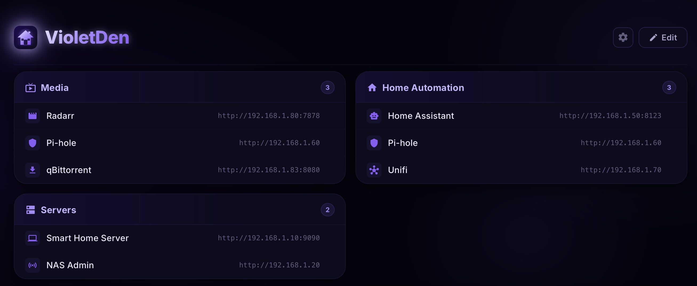
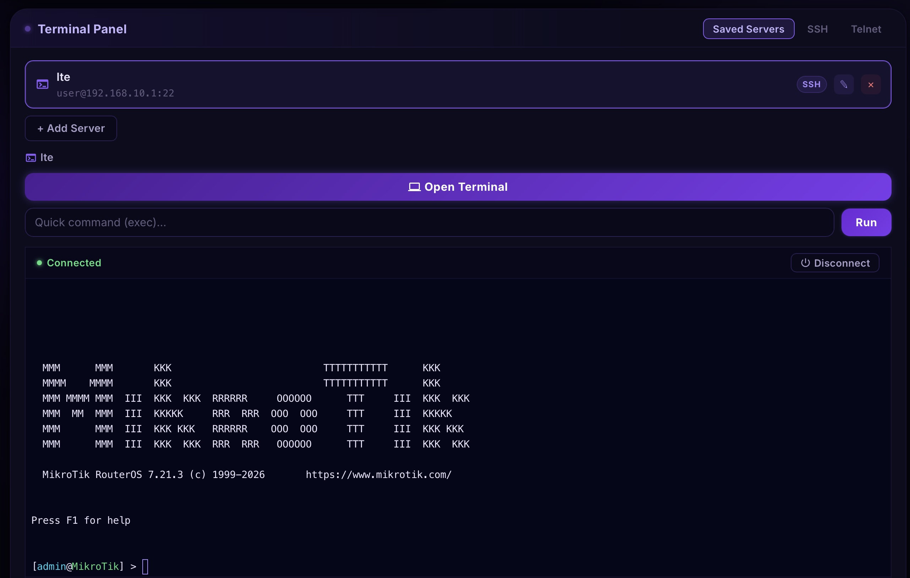

# VioletDen

A self-hosted smart home dashboard for organizing web services, devices, and network infrastructure in one place. Includes an interactive SSH web terminal, saved commands, drag-and-drop reordering, and full persistent storage.

## Features

- **View / Edit mode** — clean read-only dashboard by default; switch to edit mode for drag-and-drop reordering of sections and links, inline editing, and section management
- **Interactive SSH terminal** — full xterm.js web terminal with WebSocket SSH bridge; connect to saved servers or any host with colored terminal output, automatic resizing, and error recovery
- **Saved commands** — store frequently used commands per SSH server; run them with one click directly in the terminal
- **Dashboard sections** — organize links by category with Material Icons support and drag-and-drop reordering
- **SSH/Telnet support** — manage saved servers or connect to any host freely; SSH and Telnet protocol support
- **Persistent storage** — SQLite database stores sections, credentials, server configs, and saved commands
- **Security** — bearer-token sessions with validation on mount, AES-256-GCM encrypted SSH passwords at rest, login rate limiting
- **Settings panel** — change credentials (with password confirmation), manage self-signed SSL certificates, clear stored data / factory reset
- **Auto-generated HTTPS** — Docker automatically generates a self-signed certificate on first run; nginx handles TLS termination
- **Onboarding wizard** — guided first-run setup (before login) with mandatory credential creation and preset auto-population from `.env`
- **Configurable ports** — all exposed ports (HTTP, HTTPS, backend) configurable via `.env`
- **Dockerized** — three-container stack (frontend, backend, nginx) with named volumes for persistence; internal services not exposed to host
- **Home Assistant integration** — embed VioletDen as a sidebar panel in Home Assistant via `panel_custom`; single-container deployment with automatic HA auth passthrough, no separate login required

## Screenshots

 

## Quick Start

```bash
# 1. Clone
git clone https://github.com/askrejans/violet-den.git
cd violet-den

# 2. Configure
cp .env.example .env
# Edit .env — set credentials, ports, and optionally VITE_PRESET_SECTIONS

# 3. Build & run
docker compose up --build
```

If the build hangs on "resolving provenance", run:
```bash
BUILDX_NO_DEFAULT_ATTESTATIONS=1 docker compose build
docker compose up
```

### Access

| Service | URL |
|---------|-----|
| HTTPS (via nginx) | `https://localhost` (or your configured `HTTPS_PORT`) |
| HTTP redirect | `http://localhost` (redirects to HTTPS) |

Frontend and backend are only accessible through the nginx reverse proxy. On first visit, the onboarding wizard will guide you through creating credentials and configuring dashboard sections.

### Install as Linux Service

Run VioletDen as a systemd service (Docker-based) on any Linux system with Docker installed:

```bash
# 1. Configure
cp .env.example .env
# Edit .env — set credentials, ports, etc.

# 2. Install and start
sudo ./install.sh

# Or with Home Assistant integration (auto-detects HA network):
sudo ./install.sh --ha
```

The installer builds the Docker images, creates a systemd service, and starts it. VioletDen will auto-start on boot. The `--ha` flag auto-detects your HA Docker network, connects VioletDen's backend to it, and sets the HA environment variables — then install the HACS integration to get the sidebar panel.

```bash
# Manage the service
systemctl status violetden       # Check status
systemctl restart violetden      # Restart
journalctl -u violetden -f       # View logs

# Uninstall
sudo ./uninstall.sh              # Keep data volumes
sudo ./uninstall.sh --purge      # Remove everything including data
```

Works on Debian/Ubuntu, AlmaLinux/Rocky/RHEL, Fedora, and any systemd-based distro with Docker.

## Development (without Docker)

```bash
# Terminal 1 — Backend
cd backend
npm install
node index.js

# Terminal 2 — Frontend
cd frontend
npm install
npm run dev
```

The Vite dev server proxies `/api` and `/ws` requests to `http://localhost:4000` automatically.

## Architecture

```
┌────────────────┐      ┌──────────────┐      ┌──────────────┐
│     nginx      │─────▶│   frontend   │      │   backend    │
│ :80 → :443     │      │  Vite :5173  │      │ Express :4000│
│ (envsubst tpl) │─────▶│              │─────▶│              │
└────────────────┘      └──────────────┘      │  SQLite DB   │
      │                      │                │  SSH/Telnet  │
      │ /api/, /ws/          │ WebSocket      │  WebSocket   │
      └──────────────────────┴───────────────▶│  Terminal    │
                                              └──────────────┘
```

- **nginx** — TLS termination (auto-generated self-signed cert), HTTP→HTTPS redirect, reverse proxy with `envsubst` template for configurable backend port
- **frontend** — React 19 SPA with Vite 8; internal only (not exposed to host)
- **backend** — Express 5 API with SQLite, ssh2, and WebSocket terminal bridge; internal only

### Tech Stack

| Layer | Technology |
|-------|-----------|
| Frontend | React 19, Vite 8, xterm.js, CSS custom properties |
| Backend | Node.js, Express 5, better-sqlite3, ssh2, ws |
| Reverse Proxy | nginx (alpine) with envsubst templates and WebSocket support |
| Icons | Google Material Icons (CDN) |
| Encryption | AES-256-GCM (SSH password storage) |
| Auth | Bearer token sessions with validation & rate limiting |

## Configuration

### Environment Variables

See [`.env.example`](.env.example) for all options.

| Variable | Description | Default |
|----------|-------------|---------|
| `ADMIN_USERNAME` | Initial admin username (used until changed via onboarding) | `admin` |
| `ADMIN_PASSWORD` | Initial admin password (used until changed via onboarding) | `changeme` |
| `BACKEND_PORT` | Backend listen port (also used by nginx proxy) | `4000` |
| `HTTP_PORT` | Host port for HTTP (nginx) | `80` |
| `HTTPS_PORT` | Host port for HTTPS (nginx) | `443` |
| `CORS_ORIGINS` | Allowed CORS origins (comma-separated) | _(permissive)_ |
| `VITE_PRESET_SECTIONS` | JSON preset for onboarding auto-populate | _(empty)_ |
| `CERT_DIR` | Certificate directory (Docker: `/certs`) | `./certs` |
| `DATA_DIR` | SQLite database directory (Docker: `/data`) | `./data` |

### Docker Volumes

| Volume | Purpose |
|--------|---------|
| `certs` | SSL certificates (auto-generated by nginx, shared with backend) |
| `data` | SQLite database + encryption key |

## API Endpoints

| Method | Path | Auth | Description |
|--------|------|------|-------------|
| `GET` | `/api/setup-status` | No | Check if first-time setup is complete |
| `POST` | `/api/setup` | No | One-time first-run setup (credentials + sections) |
| `POST` | `/api/login` | No | Authenticate, returns token |
| `GET` | `/api/validate-token` | No | Check if current token is valid |
| `GET` | `/api/sections` | No | Get dashboard sections |
| `POST` | `/api/save-sections` | Yes | Save dashboard sections |
| `POST` | `/api/change-creds` | Yes | Update admin credentials |
| `GET` | `/api/ssh-services` | Yes | List saved SSH/Telnet servers |
| `POST` | `/api/ssh-services` | Yes | Add a server |
| `PUT` | `/api/ssh-services/:id` | Yes | Update a server |
| `DELETE` | `/api/ssh-services/:id` | Yes | Delete a server |
| `GET` | `/api/ssh-services/:id/commands` | Yes | List saved commands for a server |
| `POST` | `/api/ssh-services/:id/commands` | Yes | Add a saved command |
| `PUT` | `/api/commands/:id` | Yes | Update a saved command |
| `DELETE` | `/api/commands/:id` | Yes | Delete a saved command |
| `POST` | `/api/ssh` | Yes | Run command on saved server (exec mode) |
| `POST` | `/api/ssh-free` | Yes | Run command on any host (SSH) |
| `POST` | `/api/telnet` | Yes | Connect to any host (Telnet) |
| `GET` | `/api/cert-status` | Yes | Check if SSL cert exists |
| `POST` | `/api/generate-cert` | Yes | Generate self-signed SSL cert |
| `DELETE` | `/api/cert` | Yes | Remove installed certificate |
| `POST` | `/api/clear-data` | Yes | Clear stored data (sections/servers/creds/all) |
| `WS` | `/ws/terminal` | Token (query) | Interactive SSH terminal via WebSocket |

### WebSocket Terminal Protocol

Connect to `/ws/terminal?token=<bearer_token>`. Messages are JSON:

| Direction | Type | Fields | Description |
|-----------|------|--------|-------------|
| Client→Server | `connect` | `serviceId` or `host,port,username,password` + `cols,rows` | Start SSH session |
| Client→Server | `input` | `data` | Send keyboard input |
| Client→Server | `resize` | `cols,rows` | Resize terminal |
| Client→Server | `disconnect` | — | End session |
| Server→Client | `connected` | — | SSH session established |
| Server→Client | `data` | `data` | Terminal output |
| Server→Client | `error` | `data` | Error message |
| Server→Client | `disconnected` | — | Session ended |

## SSH Web Terminal

The interactive terminal uses xterm.js on the frontend connected via WebSocket to the backend's SSH bridge. Features:

- Full PTY shell with `xterm-256color` support
- Automatic terminal resizing via FitAddon and ResizeObserver
- Violet-themed terminal colors matching the dashboard
- Per-server saved commands with one-click execution
- Connect to saved servers or enter credentials manually
- Error boundary prevents terminal crashes from affecting the dashboard
- Automatic disconnect on server switch

## Security

- **Encrypted passwords** — SSH server passwords are encrypted with AES-256-GCM before storage. The encryption key is auto-generated and stored in the data volume.
- **Bearer token auth** — login returns a cryptographically random token (valid 24h). All sensitive endpoints require it.
- **Token validation** — frontend validates stored tokens on mount to prevent stale session issues after backend restarts.
- **Rate limiting** — max 10 login attempts per IP per 15-minute window.
- **Password confirmation** — credential changes require typing the password twice.
- **No plain-text secrets in DB** — admin credentials are stored as config values; SSH passwords are encrypted.
- **CORS restriction** — set `CORS_ORIGINS` in production to lock down allowed origins.
- **Domain sanitization** — certificate generation sanitizes domain input to prevent injection.
- **SSH command execution** — uses `ssh2` library (no shell spawning); `execFile` for openssl (no shell injection).
- **Onboarding before auth** — first-time setup uses a public one-time endpoint; blocked once credentials are saved.

### SSL Certificates

VioletDen automatically generates a self-signed certificate on first Docker startup via the nginx entrypoint. Since this app is designed for LAN use, Let's Encrypt is not supported (it requires a publicly resolvable domain). You can regenerate the certificate from Settings > Certificate.

### Production Recommendations

1. Always change the default credentials during onboarding
2. Set `CORS_ORIGINS` to your specific domain(s)
3. Access the app only through the HTTPS/nginx proxy
4. Keep Docker volumes backed up (especially `data` for the encryption key)
5. Consider placing the app behind a VPN for additional network-level security

## Home Assistant Integration

VioletDen can be embedded as a sidebar panel in Home Assistant, providing the full dashboard and SSH terminal experience directly within HA's UI.

### How It Works

```
┌──────────────────────────┐      ┌───────────────────────────┐
│   Home Assistant         │      │   VioletDen (single       │
│   :8123                  │      │   container) :4000        │
│                          │      │                           │
│  ┌────────────────────┐  │      │  Express serves:          │
│  │ panel_custom       │──┼──────┤  - Built React SPA        │
│  │ (iframe → :4000)   │  │      │  - REST API (/api/*)      │
│  └────────────────────┘  │      │  - WebSocket (/ws/*)      │
│                          │      │                           │
│  HA authenticates user   │      │  HA token validated       │
│  Panel sends HA token ───┼──────▶  against HA API           │
│  via postMessage         │      │  → auto-login, no wizard  │
└──────────────────────────┘      └───────────────────────────┘
```

- Works with all HA installation types (Container, Core, OS, Supervised)
- Single-container deployment (built frontend + backend) via `Dockerfile.ha`
- HA handles authentication — users see VioletDen without a separate login
- SSH/Telnet terminals work through the iframe (WebSocket passthrough)
- Standalone access at `:4000` still works with regular login

### Quick Start (HACS)

1. Run VioletDen: `sudo ./install.sh --ha` (or `docker compose up --build -d` with `HA_INTEGRATION=true` and `HA_URL` in `.env`)
2. In HA, open **HACS → Custom repositories** → add `https://github.com/askrejans/violet-den` as **Integration**
3. Download **VioletDen** from HACS, restart HA
4. Go to **Settings → Devices & Services → Add Integration → VioletDen**
5. Enter VioletDen URL (e.g., `https://192.168.1.100:443`) — panel appears in sidebar

### Quick Start (Manual)

```bash
# 1. Configure
cp .env.example .env
# Set HA_INTEGRATION=true and HA_URL=http://<ha-host>:8123

# 2. Install as service with HA auto-detection
sudo ./install.sh --ha

# 3. Copy integration to HA config
cp -r custom_components/violetden <ha-config>/custom_components/

# 4. Restart HA → Settings → Devices & Services → Add Integration → VioletDen
```

For detailed instructions, networking setup, and troubleshooting, see [homeassistant/INSTALL.md](homeassistant/INSTALL.md).

### HA-Specific Environment Variables

| Variable | Description | Default |
|----------|-------------|---------|
| `HA_INTEGRATION` | Enable HA integration mode | `false` |
| `HA_URL` | HA API URL (reachable from VioletDen container) | _(required in HA mode)_ |

## Running Tests

VioletDen includes unit and integration tests for both backend and frontend.

### Backend

```bash
cd backend
npm install
npx jest
```

Backend tests (`backend/__tests__/`) cover:
- **db.js** — config helpers (get/set/overwrite/fallback), AES-256-GCM encrypt/decrypt (round-trip, empty input, unicode, special chars)
- **Auth** — login success/failure, rate limiting, requireAuth middleware (missing header, invalid token, expired session)
- **Token validation** — valid/invalid/missing tokens via `/api/validate-token`
- **Setup** — first-time setup flow, credential saving, sections, blocking repeated setup
- **Sections** — public read, authenticated write, invalid JSON handling
- **SSH Services CRUD** — create/read/update/delete, password masking, password preservation on update
- **Saved Commands CRUD** — create/read/update/delete, cascade delete with service
- **Credentials** — change-creds validation and persistence
- **Clear Data** — clearing sections, SSH services, credentials, and full factory reset

### Frontend

```bash
cd frontend
npm install
npx jest
```

Frontend tests (`frontend/src/__tests__/`) cover:
- **api.js** — token get/set/clear, Authorization header injection, Content-Type auto-set, fetch passthrough
- **App** — setup status routing (loading → onboarding vs login), fetch error handling
- **Onboarding** — credential validation (empty, short password, mismatch), save button enable/disable, server errors, successful setup
- **AuthWrapper** — login form rendering, token validation on mount (valid/invalid/unreachable), login success/failure, loading state
- **SettingsPanel** — tab rendering, tab switching, close callback
- **IconPicker** — `isMaterialIcon` helper, icon list integrity, dropdown open/search/filter/select/clear

All new features and significant changes should include or update tests. Pull requests must pass all tests.

[MIT](LICENSE)
